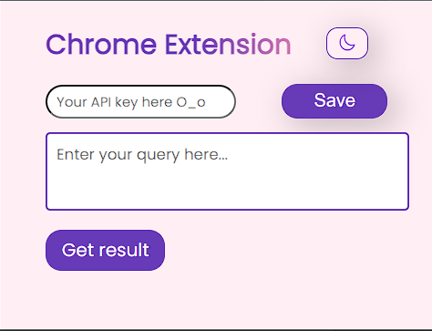
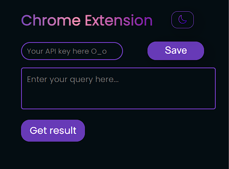
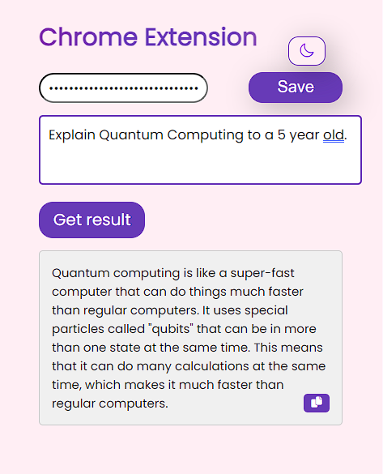
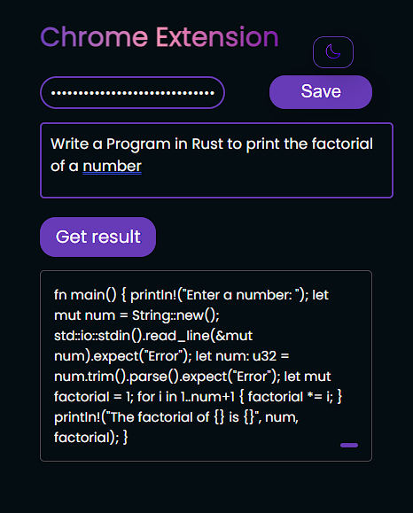

# Chrome Extension with Chat GPT integration

This readme provides instructions on how to set up and run the Chrome Extension.

## Project Overview

This Chrome Extension is designed to enhance the browsing experience by adding the full power of Chat GPT at the click of a button, without ever needing to switch tabs. It provides a user interface to interact with an API, display the results within a popup and a dark mode toggle.

## Installation and Setup

Follow these steps to set up and run the Chrome Extension project:

1. **Clone the Repository:**
   Clone the project repository to your local machine using Git:

   ```bash
   git clone <repository_url>
   ```

2. **Navigate to the Project Directory:**
   Use the terminal to navigate to the project directory:

   ```bash
   cd chrome-extension-project
   ```

3. **Load the Extension in Chrome:**
   - Open Google Chrome and go to `chrome://extensions/` in the address bar.
   - Enable "Developer mode" using the toggle switch at the top-right corner of the page.
   - Click the "Load unpacked" button and select the project directory (where the `manifest.json` file is located).
   - The extension will be loaded into Chrome.

## Usage

Once the extension is installed, you can use it to interact with the API and display query results within a popup.

1. **API Key Setup:**
   - Open the extension popup by clicking on the extension icon in the Chrome toolbar.
   - Enter your API key in the provided input field. This key is required to access the API's functionality.

2. **Query Submission:**
   - After setting up the API key, you can enter your query into the textarea provided in the popup.

3. **Get Result:**
   - Click the "Get result" button to send the query to the API and display the response within the popup.

4. **Dark Mode Toggle:**
   - Click the dark mode toggle button to switch between dark and light modes for the popup interface.

5. **Copying Results:**
   - After receiving the API response, you can click the copy button (represented by the copy icon) to copy the response to the clipboard.

6. **Saving API Key:**
   - If you want to save your API key for future use, enter the key and click the "Save" button.

## Screenshots
1. Light mode - 
2. Dark mode - 
3. Example Prompt 1 - 
4. Example Prompt 2 - 

### Design Decisions

**1. User-Friendly Interface:**
The primary goal of this Chrome Extension is to provide users with a seamless and intuitive experience. To achieve this, I focused on creating a clean and simple user interface (UI) that allows users to easily interact with the extension.

**2. Dark Mode Support:**
I included a dark mode toggle to enhance usability, allowing users to switch between light and dark themes based on their preferences. This feature enhances the user experience by accommodating different viewing environments.

**3. API Key Security:**
To ensure the security of user data, I implemented an input field for users to enter their API key. The API key is masked (type="password") to prevent unauthorized access. Additionally, I provided a "Save" button to allow users to securely store their API key for future use.

**4. Result Presentation:**
The extension uses a text area to display query results. This design decision was made to provide a clear and readable presentation of the response from the API.

### Challenges
**1. Asynchronous Operations:**
Interacting with APIs involves asynchronous operations. To handle this, I utilized JavaScript's asynchronous capabilities and implemented promises to handle API requests and responses in a non-blocking manner.

**2. Styling Consistency:**
Ensuring consistent styling across different browsers and screen sizes can be challenging. To address this, I relied on CSS frameworks like Font Awesome for icons and utilized CSS media queries to make the UI responsive and adaptable.

**3. API Key Handling:**
Handling sensitive information like API keys requires extra care. I designed the UI to mask the API key as a password field and provided an option for users to save the key securely. This design decision was made to balance convenience and security.

**4. Browser Compatibility:**
Ensuring that the extension works across different versions of Google Chrome and other browsers can be a challenge. I focused on using well-supported HTML, CSS, and JavaScript features to enhance compatibility.
